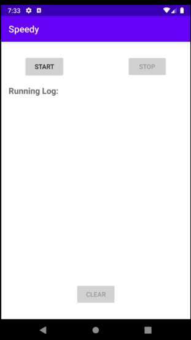
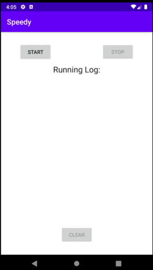

# Speedy

#### Using LinearLayoutManager

#### Using GridLayoutManager and detail screen

A simple app for runners to keep track of their running time and quality. I'll be adding more features to this as I go along in my Android development journey. 

### Learning goals of this app:

* Room persistence library
* Coroutines
* RecyclerView: both with LinearLayoutManager and GridLayoutManager

### Features I'd like to add in the future

* Geolocation: for tracking miles and pace
* Sharing functionality for each run
